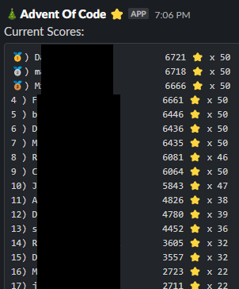
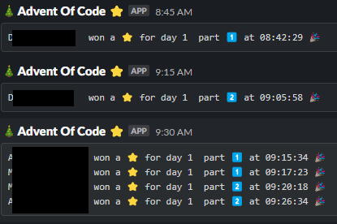

# Advent Of Code - Slack Bot

This repository contains a Slack bot that was inspired by <https://github.com/1grzyb1/aoc-slack>. It is written in PowerShell and uses the Slack API to post messages to a Slack channel.

It posts a message to Slack each time someone gains a ⭐. It also posts a daily overview of the leaderboard.





## Setup

In order to run this bot, you need to create a Slack app:

### Add app to your slack workspace

- Go to <https://api.slack.com/apps> and create a new app.
- Select "From scratch" and give it a name and workspace.
- Select incoming webhooks and activate it.
- Click "Add new webhook to your workspace" and select a channel to which you want to- receive messages.

### Build the bot

Run the `build.ps1` script to build the docker image.

```powershell
 ./build.ps1 -registry 'example.azurecr.io' -tag '2024-12-01-v1'
 ```

### Configure the bot

You can configure the bot locally using environment variables:

```plaintext
docker run  -e AOC_YEAR=2024 \ # defaults to current year
            -e AOC_SESSION_COOKIE="" \ # your session cookie from the AOC website (without the session= part)
            -e EMAIL="<your email>" \ # used in the user-agent to identify the bot
            -e AOC_LEADERBOARD_ID="" \
            -e AOC_REFRESH_DATA=true \ # enables calling the AOC API
            -e AOC_REFRESH_RATE_SECONDS="900" \ # how often to call the AOC API, default is 15 minutes
            -e SLACK_WEBHOOK="" \ 
            -e SLACK_SEND_MESSAGE=true \
            aoc_bot
```

Or by using the ARM tempaltes in the `deployment` folder.
